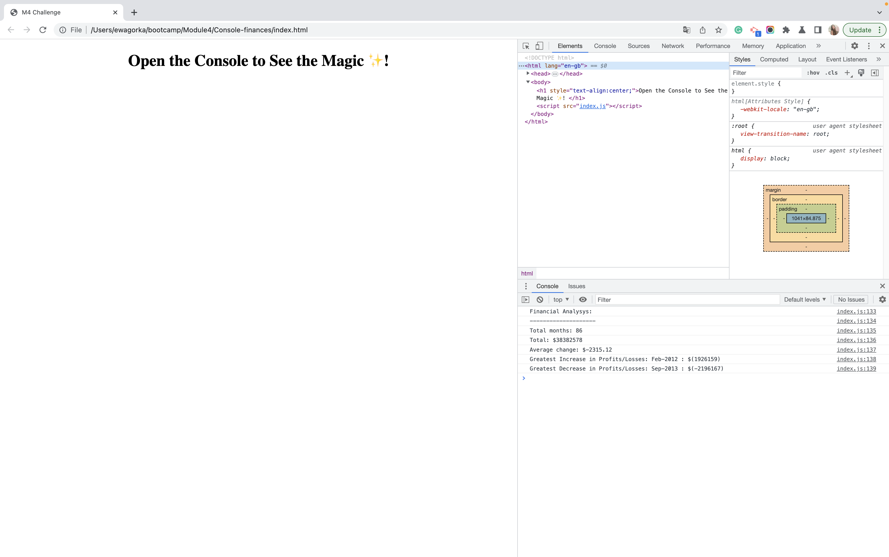

# Console-finances
This is my week 4 challenge for the front-end development bootcamp.
## Project Description
For the fourth week's challenge we were asked create a code for analyzing the financial records of a company. Our task was to write JavaScript code that analyzes the records that we've been given to calculate each of the following:
* The total number of months included in the dataset.
* The net total amount of Profit/Losses over the entire period.
* The average of the changes in Profit/Losses over the entire period.
* The greatest increase in Profit/Losses (date and amount) over the entire period.
* The greatest decrease in Profit/Losses (date and amount) over the entire period.

## My Approach
I started off by reading the instructions and studying the provided code.

After that I split the challenge into smaller, more managable tasks (each bullet point listed above was a separate task).

For each task I followed the same workflow:
* create a new branch
* initialise necessary variables
* think of a pseudo code (I left some of my pseudo code thougths as comments, to explain the logic behind my code)
* code the math (to put it shortly)
* move to the next task

To complete some of the tasks I needed to explore new concepts such as 2-dimensional arrays in JavaScript and functions that round up numbers to a designated decimal point. 

Overall I realy enjoyed working on this challenge. It allowed me to further practice for loops and if statements, as well as learn new data structures. Although some tasks required a fair amount of trial and error, I'm very happy with the end results.

## Technologies
This project was made using HTML and Javascript.

## Deployed Website
The deployed website: https://ewagorka.github.io/Console-finances/

## Deployed Website Screenshot

## License
Please refer to the LICENSE in the repo.